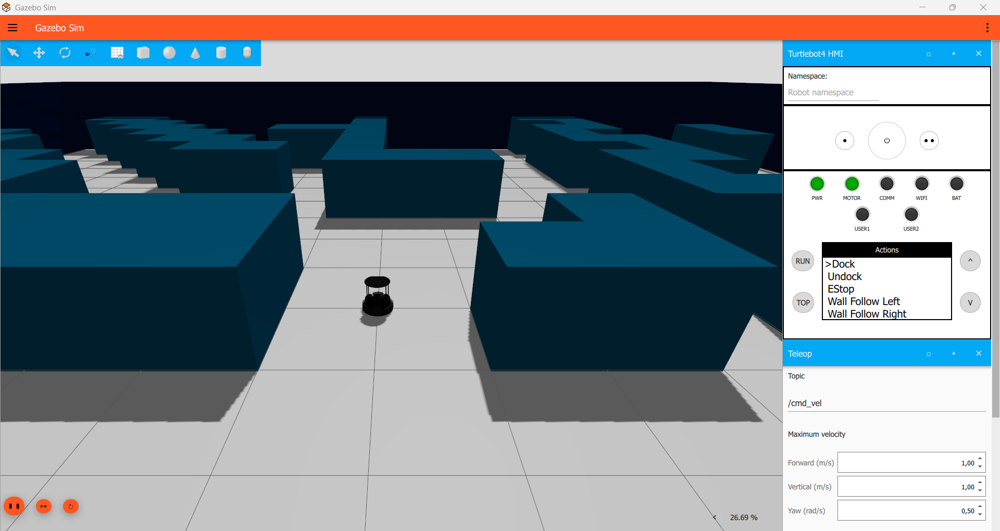

# ROSCon 2026 Intro to ROS Workshop - pixi edition

> [!WARNING] 
> 
> -- There are still reported bugs so make sure to report any issues you encounter as a ticket here as "issues" --

A cross-platform (Linux, macOS, Windows) replacement for the[turtlebot4_docker](https://github.com/kscottz/turtlebot4_docker) container.
Instead of Docker + rocker + X11 forwarding, everything (ROS 2 Jazzy, Gazebo Harmonic, and the TurtleBot 4 simulation) is installed into a local, self-contained [pixi](https://pixi.sh) environment using the[RoboStack](https://robostack.github.io) conda packages. Gazebo's GUI runs natively on your desktop.

## Prerequisites


You should have these operating system on your laptop. This is ranked from preferred to risky.

* Preferred (this will definitely work):
  * Ubuntu 24.04 Native install
* Less preferred (will most likely work): 
  * Ubuntu 26.04 Native install
  * WSL with Ubuntu 24.04 on Windows 11
* Little risky (will need some attention and potentially additional help):
  * Windows 11
* Risky (if you are brave and AI credits to spare):
  * MacOS (but mind that we will not be able to help out much here)

Let us know in the issues here if you are having issues with your system

Pre-install instructions:

1. Install pixi: https://pixi.prefix.dev/latest/installation/ 
2. Install Visual Studio Code: https://code.visualstudio.com/ (if you are using WSL make sure to install the Remote development extension)
3. **Windows only:** install Visual Studio 2022 (Community is fine) or the
   Build Tools, with the *Desktop development with C++* workload. It's needed
   to compile the TurtleBot 4 packages.

## Installation

### Ubuntu 24.04 (or 26.04)

```bash
git clone https://github.com/knmcguire/tb4_pixi
cd tb4_pixi

pixi install      
pixi run sim       
```

### WSL on Windows 11 (Ubuntu 24.04)

First in powershell make a new WSL instance:

```powershell
wsl --install -d Ubuntu-26.04 --name wsl-u2404-rosconworkshop 
```

Then open up the new wsl by powershell: 

```powershell
wsl -d wsl-u2404-rosconworkshop
```

You can also find 'wsl-u2404-rosconworkshop' as app, or open op a 'wsl-u2404-rosconworkshop' tab in the windows terminal.

Once WSL is installed and opened, install Pixi (see "Prerequisites") and do the following commands:

```bash
git clone https://github.com/knmcguire/tb4_pixi
cd tb4_pixi

pixi install      
pixi run sim       
```

### Windows 11 Natively (experimental)

Windows native install should work with this pixi install but use with caution! If it doesn't work the first time, just ctrl-c and try again. Otherwise, use the WSL version.

```bash
git clone https://github.com/knmcguire/tb4_pixi
cd tb4_pixi

pixi install      
pixi run sim       
```

### macOS (experimental)

MacOS native install should work with this pixi install but use with caution! If it doesn't work the first time, just ctrl-c and try again. Submit an issue if you are still having problems!


From the cloned repository, run:

```bash
git clone https://github.com/knmcguire/tb4_pixi
cd tb4_pixi

pixi install
pixi run sim
```

## Test basic functionality

Ofcourse we'd like to know if everything is working correctly.
If you see the following image with all the right gazebo plugins and without major error, you should be in!



In the Turtlebot HMI in the Gazebo GUI, select undock and press run.
If you see the Turtlebot in simulation move a bit forward and this in the terminal, then you are golden and ready for the workshop!

```bash
[pixi-3] [motion_control.EXE-33] [INFO] [1789328333.784803400] [motion_control]: Received new undock goal
[pixi-3] [turtlebot4_node.EXE-28] [INFO] [1789328333.785208900] [turtlebot4_node]: undock goal accepted by server, waiting for result
```

## Test out workshop code

Please follow the instructions in the presentation, but if you just want to test out the workshop code that is possible with the finished example:

```bash
# In your pixi directory e.g. ~/code/tb4_pixi
mkdir -p src/
cd src/
git clone https://github.com/kscottz/tb4_toy.git
cd ../..
pixi shell  # Source the ROS workspace
colcon build --merge-install --packages-select tb4_toy
ros2 run tb4_toy toy_node
ros2 service call /do_loopy std_srvs/Trigger '{}'
```

## Support

Make sure to file a ticket (aka making an issue here) if you need any help! Make sure to give us the following information:

* The operating system
* The error from the terminal
* The generated pixi.lock file 
* The ROS log files with the errors

### Trouble shooting

#### 1. Stop leftover simulation processes

If `Ctrl+C` leaves ROS/Gazebo processes alive, or the robot stops spawning after a restart, run:

```bash
pixi run stop-sim
```

This stops known simulator processes from this workspace, including orphaned nodes and any running simulation.
On macOS and Linux, it only targets processes owned by your user in the active Pixi environment or workspace overlay, plus their descendants.
It sends `SIGINT`, waits up to five seconds, then sends `SIGKILL` to survivors.
The existing Windows cleanup command force-stops matching process trees.

On macOS and Linux, preview the targets without stopping anything:

```bash
pixi run stop-sim --dry-run
```
#### 2. Loading world models forever

It could be that gazebo is still downloading world models for a while:

```bash
[create-8] [INFO] [xxxx.xxxx] [ros_gz_sim]: Requesting list of world names.
[create-7] [INFO] [xxxx.xxxx] [ros_gz_sim]: Requesting list of world names.
[create-8] [INFO] [xxxx.xxxx] [ros_gz_sim]: Requesting list of world names.
....
```

Usually it is normal to wait for a few minutes, but if this takes longer than 10 minutes, please check out your networking capabilities of your computer.

## Disclaimer

This repo has been generated with assistence of Github Copilot Pro and Claude Pro using various models.
